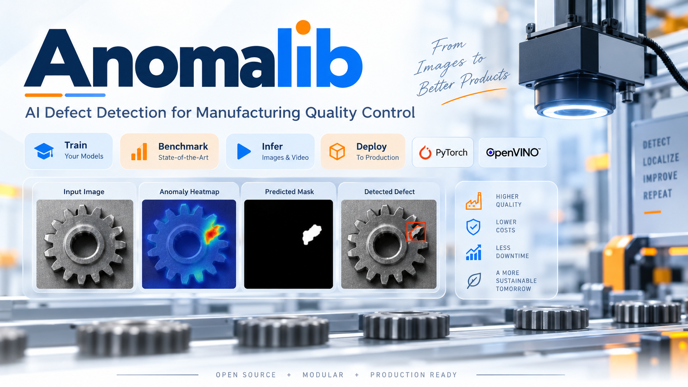
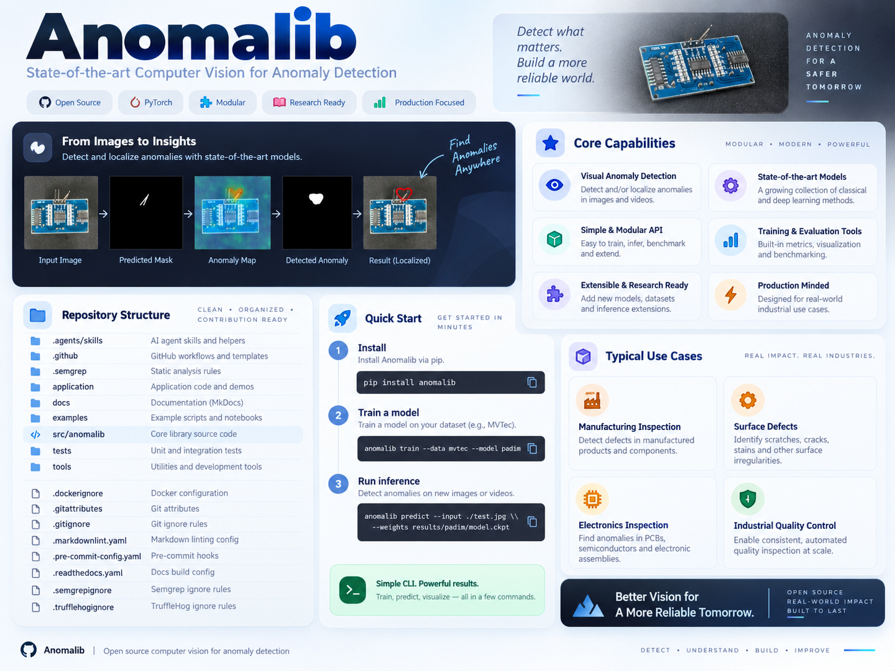
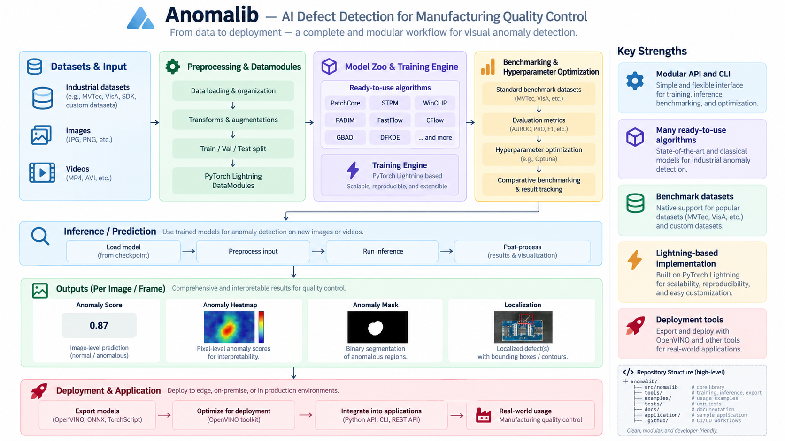

# DefectScope_AI— AI Defect Detection for Manufacturing Quality Control

<p align="center">
  
</p>

<p align="center">
  <strong>A library for benchmarking, developing, and deploying deep learning anomaly detection algorithms.</strong><br/>
  Build industrial defect detection pipelines for images and videos with a modular API, CLI, model zoo, benchmarking tools, and deployment-ready inference workflows.
</p>

<p align="center">
  <a href="#overview">Overview</a> •
  <a href="#key-capabilities">Capabilities</a> •
  <a href="#workflow--architecture">Workflow</a> •
  <a href="#installation">Installation</a> •
  <a href="#training">Training</a> •
  <a href="#inference">Inference</a> •
  <a href="#repository-structure">Repository Structure</a> •
  <a href="#use-cases">Use Cases</a> •
  <a href="#license">License</a>
</p>

<p align="center">
  
  
  
  
  
</p>

---

## Overview

**Anomalib** is an open-source computer vision library focused on **visual anomaly detection**. It provides a practical framework for benchmarking state-of-the-art methods, developing custom models, and deploying industrial inspection systems for **image and video anomaly detection**.

The project is built for teams who need more than just model training. It covers the full lifecycle of anomaly detection:

- dataset handling
- modular model development
- training and evaluation
- hyperparameter optimization
- inference and visualization
- model export and deployment
- production-oriented tooling

Typical anomaly-detection outputs include:

- image-level anomaly score
- heatmap / anomaly map
- pixel-level mask
- localized defect region

This makes the project especially suitable for **manufacturing quality control**, **surface inspection**, **electronics inspection**, and other industrial vision workflows.

---

## Key Capabilities

<p align="center">
  
</p>

### Core strengths

| Capability | Description |
|---|---|
| **Modular API and CLI** | Simple interfaces for training, inference, benchmarking, and extension. |
| **Large model collection** | A wide range of ready-to-use anomaly detection algorithms. |
| **Benchmarking support** | Built-in support for public datasets and comparative evaluation. |
| **Lightning-based design** | Reduced boilerplate and cleaner model implementation with PyTorch Lightning. |
| **OpenVINO export path** | Export many models to OpenVINO IR for accelerated Intel inference. |
| **Inference tools** | Utilities for fast prediction and easy deployment of standard and custom models. |
| **Research + production balance** | Useful for experimentation, reproducibility, and real-world industrial workflows. |

### Notable highlights

- built around modern deep learning workflows
- supports training, evaluation, and deployment in one ecosystem
- usable from both Python and the command line
- supports images and videos
- designed to be extended with custom models and datasets

---

## Workflow & Architecture

<p align="center">
  
</p>

The project workflow can be summarized as:

```text
Datasets / Images / Videos
            ↓
Preprocessing & DataModules
            ↓
Model Zoo & Training Engine
            ↓
Benchmarking / Optimization
            ↓
Inference & Prediction
            ↓
Heatmaps / Masks / Localization
            ↓
Export / Deployment / Application Integration
```

### Main pipeline stages

#### 1. Datasets and input
DefectScope_AIworks with industrial anomaly datasets and custom data sources, including image and video inputs.

#### 2. Preprocessing and datamodules
The library provides a structured path for:

- loading and organizing data
- transformations and augmentation
- train/validation/test splitting
- Lightning-based datamodule workflows

#### 3. Model training
Ready-to-use anomaly detection algorithms can be trained through a common engine, making experimentation more consistent and scalable.

#### 4. Benchmarking and optimization
The framework supports comparative evaluation and hyperparameter optimization for reproducible benchmarking.

#### 5. Inference and outputs
Prediction results can include:

- anomaly score
- anomaly heatmap
- anomaly mask
- localized defects / contours / regions

#### 6. Deployment
Models can be exported and integrated into production applications using formats and tools such as OpenVINO, ONNX, and TorchScript where supported.

---

## Installation

DefectScope_AIcan be installed from PyPI. Using a virtual environment is recommended.

### Quick install

```bash
# With uv
uv pip install anomalib

# Or with pip
pip install anomalib
```

---

## Advanced Installation

### Hardware-specific extras

```bash
# CPU
uv pip install "anomalib[cpu]"

# CUDA 12.6
uv pip install "anomalib[cu126]"

# CUDA 13.0
uv pip install "anomalib[cu130]"

# ROCm
uv pip install "anomalib[rocm]"

# Intel XPU
uv pip install "anomalib[xpu]"
```

The same extras can also be used with `pip`, for example:

```bash
pip install "anomalib[cu130]"
```

### Additional optional dependency groups

```text
[openvino]   # Intel OpenVINO optimization
[clip]       # vision-language models
[vlm]        # advanced VLM backends
[loggers]    # experiment tracking
[notebooks]  # notebook support
[full]       # all optional dependencies
```

### Examples

```bash
# OpenVINO + CUDA 13.0
uv pip install "anomalib[openvino,cu130]"

# Full CPU-only setup
uv pip install "anomalib[full,cpu]"
```

---

## Install from Source

For development or contribution workflows:

### Using `uv`

```bash
git clone https://github.com/open-edge-platform/anomalib.git
cd anomalib

uv venv
uv sync --extra cpu
```

Examples:

```bash
uv sync --extra cu130
uv sync --extra dev --extra cpu
```

### Using `pip`

```bash
git clone https://github.com/open-edge-platform/anomalib.git
cd anomalib

pip install -e ".[cpu]"
pip install -e ".[dev,cpu]"
```

---

## Training

DefectScope_AIsupports both **Python API** and **CLI-based** training.

### Python API

```python
from anomalib.data import MVTecAD
from anomalib.models import Patchcore
from anomalib.engine import Engine

datamodule = MVTecAD()
model = Patchcore()
engine = Engine()

engine.fit(datamodule=datamodule, model=model)
```

### Command line

```bash
# Train with default settings
DefectScope_AItrain --model Patchcore --data anomalib.data.MVTecAD

# Train with a specific category
DefectScope_AItrain --model Patchcore --data anomalib.data.MVTecAD --data.category transistor

# Train with a config file
DefectScope_AItrain --config path/to/config.yaml
```

---

## Inference

The library supports multiple inference workflows including Torch, Lightning, Gradio, and OpenVINO-based usage.

### Python API

```python
predictions = engine.predict(
    datamodule=datamodule,
    model=model,
    ckpt_path="path/to/checkpoint.ckpt",
)
```

### Command line

```bash
# Basic prediction
DefectScope_AIpredict --model anomalib.models.Patchcore \
                 --data anomalib.data.MVTecAD \
                 --ckpt_path path/to/model.ckpt

# Prediction with returned results
DefectScope_AIpredict --model anomalib.models.Patchcore \
                 --data anomalib.data.MVTecAD \
                 --ckpt_path path/to/model.ckpt \
                 --return_predictions
```

For advanced inference modes and deployment details, the project documentation should be consulted.

---

## Repository Structure

The repository is organized for both library development and practical usage.

```text
AI-Defect-Detection-for-Manufacturing-Quality-Control/
├── .agents/skills/         # AI-agent skills and helpers
├── .github/                # GitHub workflows and templates
├── .semgrep/               # Static analysis rules
├── application/            # Application code and demos
├── docs/                   # Project documentation
├── examples/               # Example scripts and notebooks
├── src/anomalib/           # Core library source code
├── tests/                  # Unit and integration tests
├── tools/                  # Utilities and developer tools
├── .dockerignore
├── .gitattributes
├── .gitignore
├── .markdownlint.yaml
├── .pre-commit-config.yaml
├── .readthedocs.yaml
├── .semgrepignore
└── .trufflehogignore
```

### Important directories

| Path | Purpose |
|---|---|
| `src/anomalib/` | Main source code for the anomaly detection library |
| `examples/` | Example scripts and notebooks |
| `application/` | Supporting application/demo layer |
| `tools/` | Inference, utility, and developer tooling |
| `tests/` | Testing and validation |
| `docs/` | Documentation and guides |

---

## Use Cases

DefectScope_AIis well suited for a broad set of inspection and anomaly detection scenarios:

- **manufacturing inspection** — detect product and assembly defects
- **surface inspection** — identify scratches, cracks, and irregularities
- **electronics inspection** — detect anomalies in PCBs and electronic components
- **industrial quality control** — enable automated inspection at scale
- **research benchmarking** — compare anomaly detection methods on standard datasets
- **production deployment** — integrate trained models into downstream applications

---

## Why It Works Well for Industrial Projects

This project is attractive for real-world deployment because it combines:

- a reusable model ecosystem
- modern training abstractions
- benchmark support
- export paths for optimized inference
- modular developer workflows
- clear training-to-deployment continuity

That makes it useful not just as a research library, but as a foundation for **production-grade industrial vision systems**.

---

## Documentation and Resources

Useful project areas include:

- `docs/`
- `examples/notebooks`
- inference tools under `tools/`
- project documentation site for deeper deployment and usage details

---

## License

Refer to the repository `LICENSE` file for the project’s license details.

---

<p align="center">
  <strong>Detect defects earlier. Improve product quality. Deploy inspection systems faster.</strong>
</p>
